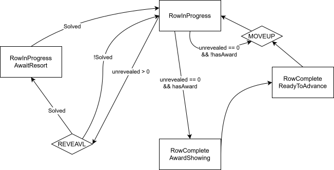

# Pyrite
A fast, memory-efficient ICPC contest resolver for DomJudge.
Created after being thoroughly tortured by the ICPC Tool.
> [!CAUTION]
> This program is still experimental. Use it in production at your own risk.

## Usage
First, download the binary from the Releases page. It is fully self-contained and can be run directly.  
The program requires a **CDP (Contest Data Path)** to operate. An example directory structure is shown below:
```
.
├── affiliations
│   ├── INST-001.jpg
│   ├── ....
│   └── INST-235.jpg
├── config.toml
├── event-feed.ndjson
└── teams
    ├── team002.jpg
    ├── ....
    └── team417.jpg
```
Use the GUI to set the CDP path. The program will automatically validate the structure and parse the event feed.

> [!TIP]  
> The `config.toml` file is optional. It can be used to customize behavior and apply post-processing to the event feed (for example, to fix malformed data). If you need additional post-processing features, please open an issue.

Next, configure the awards in the GUI. The `Gold`, `Silver`, and `Bronze` medal-winning teams will be visualized for review. Make sure to double-check everything before proceeding, once the presentation starts, it cannot be undone.

> [!NOTE]  
> The selected categories will also be used during the resolver presentation. Be sure to uncheck groups such as `Star` if they should not be included.

When the resolver presentation is running:

* Press `F12` to toggle full screen.
* Press `Space` to advance the resolution process.

Animation speed is configured in the `config.toml` file and cannot be changed during the presentation. Be sure to test everything beforehand.

Main logic is shown as following state machine.



## Build

### Windows Native AOT static linking

For a fully static Windows AOT build, first place the required static libraries inside the `Native` directory:

* [https://github.com/2ndlab/ANGLE.Static](https://github.com/2ndlab/ANGLE.Static)
* [https://github.com/2ndlab/SkiaSharp.Static](https://github.com/2ndlab/SkiaSharp.Static)

The expected files are:

```text
Native\libHarfBuzzSharp.lib
Native\skia.lib
Native\SkiaSharp.lib
Native\av_libglesv2.lib
```

Then uncomment the `ItemGroup` labeled `ImportLib` in `Pyrite.csproj` so the AOT publish can link these libraries through `DirectPInvoke` / `NativeLibrary`.

From a Windows PowerShell terminal, run:

```powershell
dotnet publish .\Pyrite.csproj -c Release -r win-x64 -p:PublishAot=true --self-contained true
```

To publish into a fixed output directory, run:

```powershell
dotnet publish .\Pyrite.csproj -c Release -r win-x64 -p:PublishAot=true --self-contained true -o .\out\win-x64-aot
```

`Pyrite.csproj` already sets `PublishAot` to `true`, but keeping `-p:PublishAot=true` in the command makes the release intent explicit. The published executable will be under the selected output directory, or under `bin\Release\net10.0\win-x64\publish` when `-o` is not specified.
